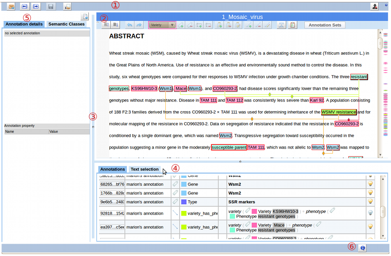

# AlvisAE User Guide

## Introduction
AlvisAE is a tool designed to seamlessly perform the annotation of textual documents.
Because it is a Web Application, no installation is needed to start using AlvisAE : Indeed, AlvisAE runs on any platform providing a modern web browser (such as Firefox, Safari, Chrome).

## Brief description
AlvisAE has been designed to facilitates the annotation of textual documents, with the goal of extracting knowledge. To do so, AlvisAE displays the text of the document, that can optionally includes some simple formatting; 
Annotations are superimposed to the text, in a way that do not impair the readability. 
Each Annotations belongs to a _Type_, and is displayed according to this _Type_ (the list of _Types_ and their associated colors are specified in the _Annotation Schema_).  

###  Quick start: creating a _Text Annotation_

Creating an _Text Annotation_ is fairly intuitive: simply select the words of interest with the mouse pointer, choose the desired annotation _Type_ in the toolbar and click the “Create Text Annotation” button [  ].

### Annotations come in 3 differents _Kinds_

1.  _Text Annotations_, also called primary annotation because they are bound to a part of the text

Besides Text Annotations, AlvisAE allows to edit 2 kinds of secondary annotation, which are not bound to text but are referencing other annotations:

2.  _Relation_ -  which contains a fixed number of arguments, each argument being associated to a named role.

3.  _Group_ - simple set of reference to other annotations (called components)

###  Creating secondary annotations

Creating secondary annotations is rather simple:

* A Relation between 2 Text Annotations is created by dragging the first annotation and dropping it onto the other one (drag the icon that appears at the top left corner of the annotation  ); 
* For more complex Relations (i.e. concerning more than 2 primary annotations, or some secondary annotation), you will need to select the arguments to be included in the relation from the Annotation Table, then clicking the "Create Relation" button [  ].
* Creating Groups is also performed by selecting the components in the Annotation Table, then clicking the "Create Group" button [  ].

## Tour of AlvisAE

### start using AlvisAE

you can experiment AlvisAE with the online demo at [AlvisAE Demo](https://bibliome.jouy.inra.fr/alvisae/demo/AlvisAE/)

### Athentification
since each user can edit its own annotation, you will need to authenticate before doing any modification.

 If you are trying the online demo, login name and password are both : @foo@

### Campaign and document selection

Once authenticated, AlvisAE will display the list of the available Campaigns. 
Each campaign contains a set of documents that can be annotated according to the Annotation schema specific to the campaign.
 
When selecting a specific campaign in the first table, the list of the corresponding documents will be displayed in the second table.
Double-click on the desired document line to start annotating it (or click the "Annotate selected document" button [  ])
  

### Editing view

The selected document is displayed in the editing view:

The editing view can be divided in the following parts:
  
1. **Global toolbar**, providing commands to: 
	* browse documents [  /  ], 
	* return to campaigns & documents list [  ],
	* save the edited annotations [  ],
	* end the annotation of the current document [  ],
	* menu to sign-out or [[Aae_UserGuide#Password-change|change password]] [  ]
2. [[Aae_UserGuide#Editor-panel|Editor panel]], which display the document itself and commands to annotate it
3. resizeable **Panel-Boundaries**, to organize the space within the browser window 
4. [[Aae_UserGuide#Annotation-Table|Annotation table]], displaying annotation in a tabular format
5. **Side panel**, used to display and edit Annotation properties
6. **Status bar**, displaying system messages and network activity

## Editor panel
### Title Bar

 double-clicking on the title bar will maximize the document panel (double-click on it again to restore normal view) 

 when the title of the document is underlined, it contains an hyperlink to the source of the document (typically the PDF version of the document) 

### ToolBar

the toolbar contains all the commands used to edit annotations: 
*  increase text interline size,
*  decrease interline size,

*  undo last edit (shortcut [ @Ctrl & Z@ ]),
*  redo last undo-ed edit (shortcut [ @Ctrl & Y@ ]),

* choose annotation _Type_ from the drop-down list,

*  create a new Text Annotation with the currently selected text portion (shortcut [ @A@ ]),
*  remove the currently selected Text Annotation (shortcut [ @Del@ ]),

*  add the selected text to the selected Text Annotation,
*  remove the selected text from the selected Text Annotation,

*  create a Group with the selected annotations,
*  remove the selected Group,
*  edit the selected Group (add/remove components),

*  create a Relation with the selected annotations,
*  remove the selected Relation,
*  edit the selected Relation (change type and/or arguments),

*  /  switch between Text selection and secondary annotation selection mode (shortcut [ @V@ ]),

*  display the current Annotation Schema,
*  validate the current document,

* select the displayed Annotation Sets

 The toolbar can be collapsed by clicking on the small triangular icon on the top left side [  ]

## Annotation Tool

## Termino-Ontology Extension

## Miscellaneous

